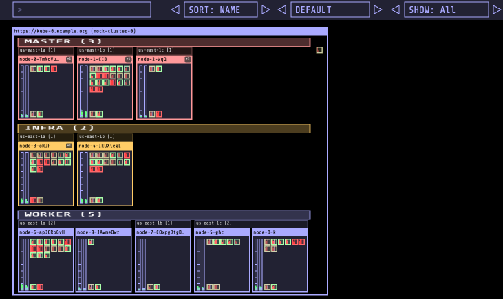

# Kubernetes Operational View

[](https://github.com/thpham/kube-ops-view/actions/workflows/docker-publish.yml)

> This is a maintained fork of [hjacobs/kube-ops-view](https://codeberg.org/hjacobs/kube-ops-view) with modernized dependencies and additional features.



Goal: provide a common operational picture for multiple Kubernetes clusters.

## Features

- Render nodes and indicate their overall status ("Ready")
- Show node capacity and resource usage (CPU, memory)
  - Render one "box" per CPU and fill up to sum of pod CPU requests/usage
  - Render vertical bar for total memory and fill up to sum of pod memory requests/usage
- **Node pool grouping with availability zone columns and color-coded visualization**
- Render individual pods
  - Indicate pod status by border line color (green: ready/running, yellow: pending, red: error etc)
  - Show current CPU/memory usage by small vertical bars
  - System pods ("kube-system" namespace) will be grouped together at the bottom
- Provide tooltip information for nodes and pods
- Animate pod creation and termination

### What's Different in This Fork

- **Modernized stack**: Python 3.12, UBI10 minimal base image
- **Node pool grouping**: Visual grouping by node pools with AZ column layout
- **Security focused**: Regular dependency updates via Dependabot
- **Multi-arch images**: AMD64 and ARM64 support
- **OpenShift support**: Ready-to-use deployment manifests

## What It Is Not

- It's not a replacement for the [Kubernetes Dashboard](https://github.com/kubernetes/dashboard)
- It's not a monitoring solution
- It's not an operation management tool - it's read-only

## Usage

### Running Locally

You can run the app locally with `kubectl proxy` against your running cluster:

```bash
kubectl proxy &
docker run -it --net=host ghcr.io/thpham/kube-ops-view
```

If you are using Docker for Mac:

```bash
kubectl proxy --accept-hosts '.*' &
docker run -it -p 8080:8080 -e CLUSTERS=http://docker.for.mac.localhost:8001 ghcr.io/thpham/kube-ops-view
```

Now direct your browser to http://localhost:8080

You can also try the UI with the integrated mock mode (no cluster access required):

```bash
docker run -it -p 8080:8080 ghcr.io/thpham/kube-ops-view --mock
```

### Installation

#### Kubernetes

```bash
kubectl apply -k deploy  # apply all manifests from the folder
kubectl port-forward service/kube-ops-view 8080:80
```

Now direct your browser to http://localhost:8080/

#### OpenShift

See the [openshift/](openshift/) folder for deployment options:

- `openshift/deploy/` - Basic deployment with Route
- `openshift/deploy-with-oauth-proxy/` - Deployment with OAuth proxy for authentication

```bash
kubectl apply -k openshift/deploy
```

## Development

The app can be started in "mock mode" to work on UI features without running any Kubernetes cluster:

```bash
poetry install
cd app && npm install && npm start &  # watch and compile JS bundle
poetry run python -m kube_ops_view --mock --debug
```

## Building

Build the Docker image using the provided `Justfile`:

```bash
just
```

Or build directly with Docker:

```bash
docker build -t kube-ops-view .
```

## Multiple Clusters

Multiple clusters are supported by passing a list of API servers, reading a kubeconfig file, or pointing to an HTTP Cluster Registry endpoint.

See the [documentation on multiple clusters](https://kubernetes-operational-view.readthedocs.io/en/latest/multiple-clusters.html) for details.

## Configuration

The following environment variables are supported:

| Variable                 | Description                                                                                        |
| ------------------------ | -------------------------------------------------------------------------------------------------- |
| `CLUSTERS`               | Comma separated list of Kubernetes API server URLs. Defaults to `http://localhost:8001/`           |
| `KUBECONFIG_PATH`        | Path to kubeconfig file to use for cluster access                                                  |
| `KUBECONFIG_CONTEXTS`    | Comma separated list of contexts to use from kubeconfig                                            |
| `CLUSTER_REGISTRY_URL`   | URL to cluster registry returning list of Kubernetes clusters                                      |
| `QUERY_INTERVAL`         | Interval in seconds for querying clusters (default: 5)                                             |
| `REDIS_URL`              | Optional Redis server for pub/sub when running multiple replicas. Example: `redis://my-redis:6379` |
| `SERVER_PORT`            | HTTP port to listen on (default: `8080`)                                                           |
| `DEBUG`                  | Set to "true" for local development to reload code changes                                         |
| `MOCK`                   | Set to "true" to mock Kubernetes cluster data                                                      |
| `ROUTE_PREFIX`           | URL prefix for reverse proxy setups                                                                |
| `NODE_LINK_URL_TEMPLATE` | Template to make Nodes clickable. Variables: `{cluster}`, `{name}`                                 |
| `POD_LINK_URL_TEMPLATE`  | Template to make Pods clickable. Variables: `{cluster}`, `{namespace}`, `{name}`                   |

### OAuth Configuration

| Variable           | Description                                             |
| ------------------ | ------------------------------------------------------- |
| `AUTHORIZE_URL`    | OAuth 2 authorization endpoint URL                      |
| `ACCESS_TOKEN_URL` | Token endpoint URL for OAuth 2 Authorization Code Grant |
| `SCOPE`            | OAuth scope for access level                            |
| `CREDENTIALS_DIR`  | Directory to read OAuth credentials from                |

## Supported Browsers

The UI uses WebGL, ECMAScript 6, and EventSource features:

- Chrome/Chromium 53.0+
- Mozilla Firefox 49.0+

## Contributing

PRs are welcome! Please open an issue first to discuss significant changes.

## Acknowledgments

This project is a fork of [kube-ops-view](https://codeberg.org/hjacobs/kube-ops-view) originally created by [Henning Jacobs](https://codeberg.org/hjacobs).

## License

This program is free software: you can redistribute it and/or modify it under the terms of the GNU General Public License as published by the Free Software Foundation, either version 3 of the License, or (at your option) any later version.

This program is distributed in the hope that it will be useful, but WITHOUT ANY WARRANTY; without even the implied warranty of MERCHANTABILITY or FITNESS FOR A PARTICULAR PURPOSE. See the GNU General Public License for more details.

You should have received a copy of the GNU General Public License along with this program. If not, see <http://www.gnu.org/licenses/>.
